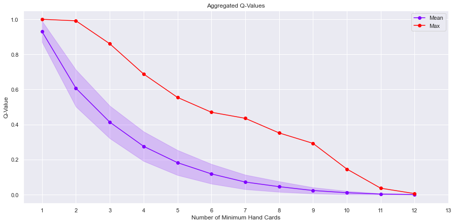
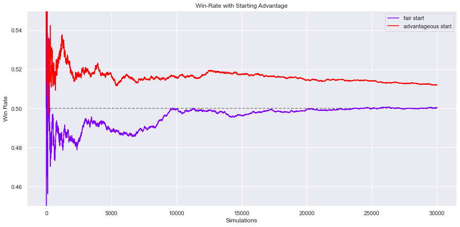
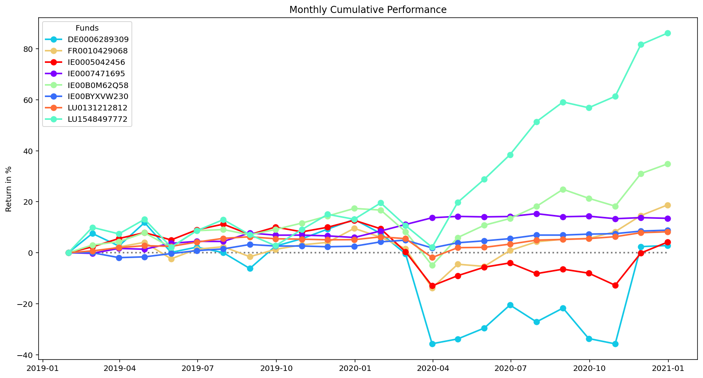
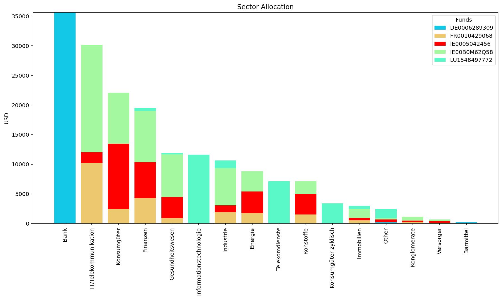

# My Project Portfolio

---

## [Project 1: Predictive Yield Curve Modeling](https://github.com/bernhard-pfann/pca-yield-curve-analytics)
This project studies the yield curve dynamics in reduced dimensionality by applying principal components analysis (PCA). 

<u>Following topics have been tackled:</u>
- Supporting the interpretation of the first 3 principal components (PCs) in accordance with traditional (level, slope, curvature) factors
- Testing out-of-sample fit for model yield curves, generated from reduced principal components set
- Derivation of non-linear stress scenarios for each component (1-month ahead 95% confidence)
- Testing predictability with an autoregressive timeseries model
- [See Article](https://bernhard-pfann.medium.com/decomposing-predicting-the-euro-yield-curve-b3ad1670fdbb)

---

## [Project 2: Tackling the UNO Card Game with Reinforcement Learning](https://github.com/bernhard-pfann/uno-card-game_rl)
- Created a game engine of the UNO card game from scratch
- Obtained game statistics from simulating a series of 100,000 games
- Implemented Reinforcement Learning agent (Q-Learning, Monte Carlo) in order to discover an optimal game strategy
- [See article](https://bernhard-pfann.medium.com/tackling-uno-card-game-with-reinforcement-learning-fad2fc19355c)

---

## [Project 3: Web Scraping Fund Data & Portfolio Analysis](https://nbviewer.jupyter.org/github/bernhard-pfann/web-scraping-fund-data/blob/main/main.ipynb)
- Created a tool that stratifies a user-defined portfolio of funds
- Scraped publicly available fund data from webpage www.fondsprofessionell.at
- Scraped publicly available fx rates from ECB to convert financials into common reporting currency

