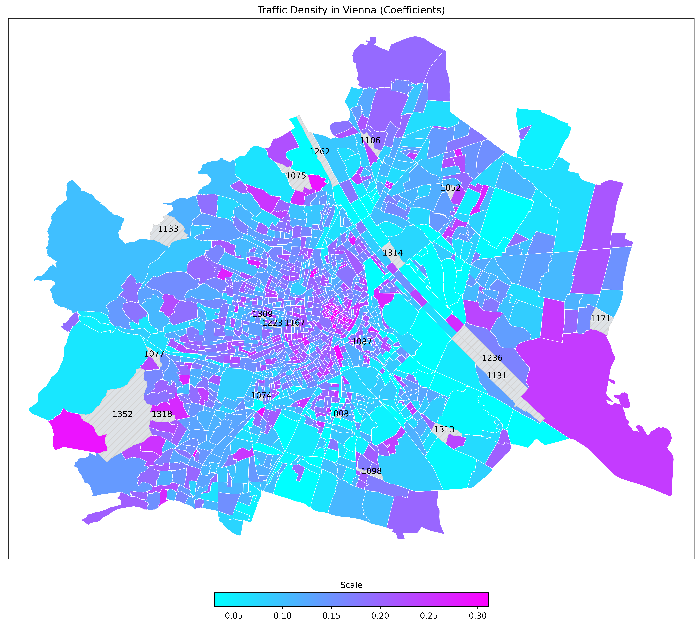

# My Project Portfolio

---

## [Modeling Traffic Density of Vienna (05/2021)](https://github.com/bernhard-pfann/vienna-traffic-density)
In this project I attempt to model the traffic density for the City of Vienna solely based on publicly available data.

  
  

<u>Executive Summary:</u>
- Initialize a network graph consisting of all officially recorded streets of the City of Vienna
- Dervie the shortest path through the networkf or every start/end combination within the set of Uber rides
- Frame a constrained optimiziation problem to derive "density-coefficients" per each area
- Analyze traffic-density per area during different times of the day
- [See article](https://bernhard-pfann.medium.com/modeling-traffic-density-of-the-city-of-vienna-c41480c35523)

---

## [Predictive Yield Curve Modeling (02/2021)](https://github.com/bernhard-pfann/pca-yield-curve-analytics)
This project studies the yield curve dynamics in reduced dimensionality by applying principal components analysis (PCA). 

  
  

<u>Executive Summary:</u>
- Supporting the interpretation of the first 3 principal components (PCs) in accordance with traditional (level, slope, curvature) factors
- Testing out-of-sample fit for model yield curves, generated from reduced PC set
- Derivation of non-linear stress scenarios for each component (1-month ahead 95% confidence)
- Testing predictability with an autoregressive timeseries model
- [See article](https://bernhard-pfann.medium.com/decomposing-predicting-the-euro-yield-curve-b3ad1670fdbb)

---

## [Tackling the UNO Card Game with Reinforcement Learning (01/2021)](https://github.com/bernhard-pfann/uno-card-game_rl)
This project is able to simulate the UNO card game and is thereby able to train an intelligent agent to find an optimal playing strategy.

  
  

<u>Executive Summary:</u>
- Created a game engine of the UNO card game from scratch
- Obtained game statistics from simulating a series of 100,000 games
- Implemented Reinforcement Learning agent (Q-Learning, Monte Carlo) in order to discover an optimal game strategy
- [See article](https://bernhard-pfann.medium.com/tackling-uno-card-game-with-reinforcement-learning-fad2fc19355c)

---

## [Web Scraping Fund Data & Portfolio Analysis (11/2020)](https://nbviewer.jupyter.org/github/bernhard-pfann/web-scraping-fund-data/blob/main/main.ipynb)
<u>Executive Summary:</u>
- Created a tool that stratifies a user-defined portfolio of funds
- Scraped publicly available fund data from webpage www.fondsprofessionell.at
- Scraped publicly available fx rates from ECB to convert financials into common reporting currency

  
  

